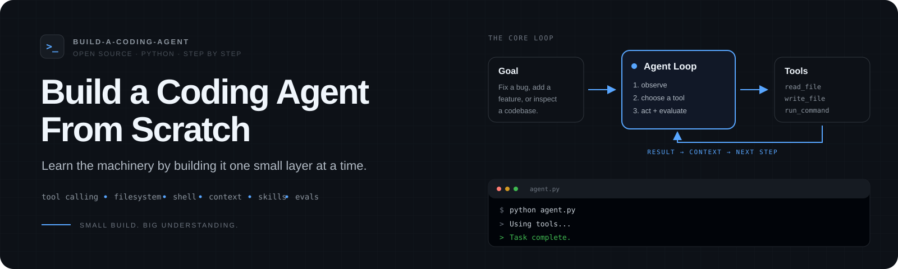
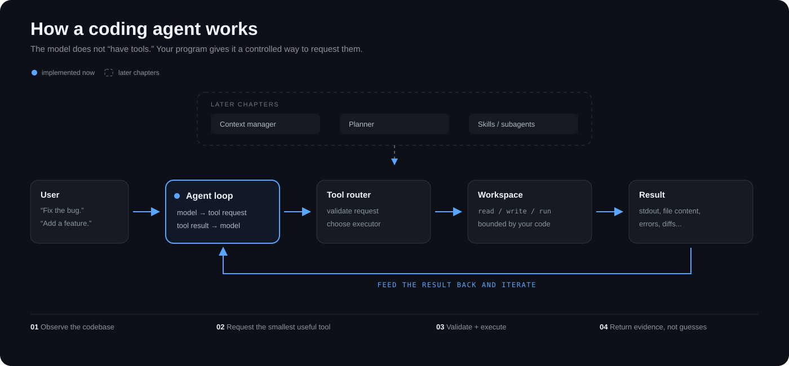
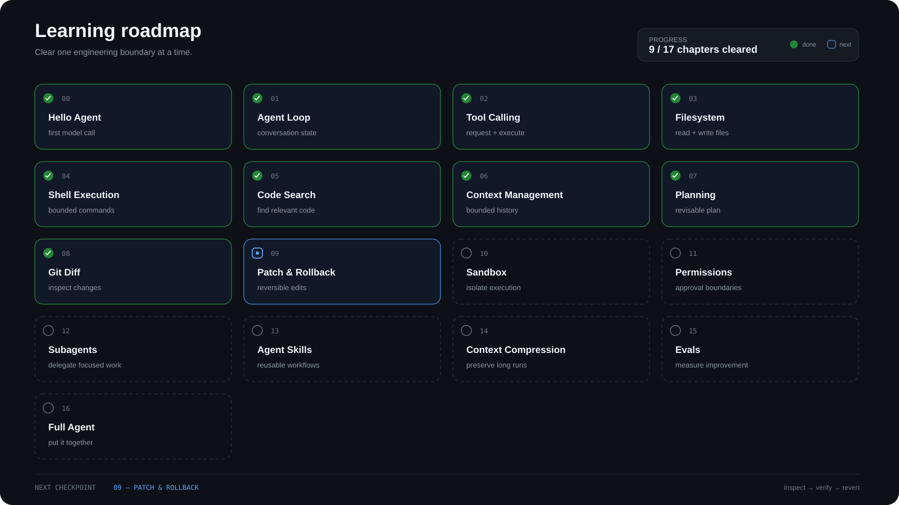

<p align="center">
  
</p>

<p align="center">
  <a href="https://github.com/gaedsstudio/build-a-coding-agent/actions/workflows/tests.yml"></a>
  
  
</p>

<p align="center">
  <strong>Build the loop, not the wrapper.</strong><br />
  A step-by-step course for understanding coding agents by implementing the machinery yourself.
</p>

<p align="center">
  <a href="#start-here">Start here</a> ·
  <a href="#how-it-works">How it works</a> ·
  <a href="#course">Course</a> ·
  <a href="./docs/ROADMAP_GUIDE.md">Chapter guide</a> ·
  <a href="./docs/PLAYBOOK.md">Playbook</a> ·
  <a href="./challenges/README.md">Challenges</a>
</p>

---

## Why this repository exists

A coding agent can look mysterious when everything arrives at once: model calls, tool schemas, filesystem access, shell execution, code search, planning, context management, permissions, sandboxes, skills, subagents, and evals.

This repository takes the opposite approach.

**Add one capability. Run it. Understand the boundary. Then add the next one.**

There is no agent framework hiding the important parts. The examples intentionally keep the core loop visible so you can see where model output ends and your program's authority begins.

> **No LangChain. No giant abstraction layer. No magic step between “the model asked” and “the machine did it.”**

By the end, you will have a small but real coding agent that can inspect a repository, change files, run development commands, evaluate results, and iterate on its own work.

## How it works

<p align="center">
  
</p>

The central idea is deliberately small:

```python
while True:
    response = model(messages, tools=tools)

    if not response.tool_calls:
        return response.text

    messages.append(response.as_message())

    for call in response.tool_calls:
        result = execute(call)
        messages.append(tool_result(call, result))
```

A model does not directly own your filesystem, shell, or Git repository. It produces a **request**. Your executor validates that request, performs an allowed action, and feeds evidence back into the loop.

That separation is what later chapters build on for safer execution, permissions, rollback, context management, and evals.

## Course

<p align="center">
  
</p>

The first nine chapters are implemented. **`09-patch-and-rollback` is the next checkpoint.**

| Chapter | What you build | Status | Guide |
| --- | --- | :---: | --- |
| [`00-hello-agent`](./00-hello-agent) | The smallest useful model call | ✅ | [mission](./docs/ROADMAP_GUIDE.md#00--hello-agent) |
| [`01-agent-loop`](./01-agent-loop) | Persistent conversation state and a stop condition | ✅ | [mission](./docs/ROADMAP_GUIDE.md#01--agent-loop) |
| [`02-tool-calling`](./02-tool-calling) | A real model → tool → result loop | ✅ | [mission](./docs/ROADMAP_GUIDE.md#02--tool-calling) |
| [`03-filesystem`](./03-filesystem) | Workspace-scoped file listing, reading, and writing | ✅ | [mission](./docs/ROADMAP_GUIDE.md#03--filesystem) |
| [`04-shell-execution`](./04-shell-execution) | Constrained development command execution | ✅ | [mission](./docs/ROADMAP_GUIDE.md#04--shell-execution) |
| [`05-code-search`](./05-code-search) | Find relevant code without reading the whole repository | ✅ | [mission](./docs/ROADMAP_GUIDE.md#05--code-search) |
| [`06-context-management`](./06-context-management) | Keep recent complete tool exchanges inside an explicit context budget | ✅ | [mission](./docs/ROADMAP_GUIDE.md#06--context-management) |
| [`07-planning`](./07-planning) | Keep a revisable plan with status and evidence | ✅ | [mission](./docs/ROADMAP_GUIDE.md#07--planning) |
| [`08-git-diff`](./08-git-diff) | Inspect the exact tracked patch after editing | ✅ | [mission](./docs/ROADMAP_GUIDE.md#08--git-diff) |
| `09-patch-and-rollback` | Make edits reversible | 🚧 | [mission](./docs/ROADMAP_GUIDE.md#09--patch--rollback) |
| `10-sandbox` | Isolate dangerous operations | planned | [mission](./docs/ROADMAP_GUIDE.md#10--sandbox) |
| `11-permissions` | Add explicit approval boundaries | planned | [mission](./docs/ROADMAP_GUIDE.md#11--permissions) |
| `12-subagents` | Delegate focused tasks | planned | [mission](./docs/ROADMAP_GUIDE.md#12--subagents) |
| `13-agent-skills` | Load reusable domain workflows | planned | [mission](./docs/ROADMAP_GUIDE.md#13--agent-skills) |
| `14-context-compression` | Keep long-running sessions useful | planned | [mission](./docs/ROADMAP_GUIDE.md#14--context-compression) |
| `15-evals` | Measure whether the agent is actually improving | planned | [mission](./docs/ROADMAP_GUIDE.md#15--evals) |
| `16-full-agent` | Put the system together | planned | [mission](./docs/ROADMAP_GUIDE.md#16--full-agent) |

Each chapter is a standalone checkpoint. The [Roadmap Guide](./docs/ROADMAP_GUIDE.md) gives every box a **goal, clear condition, trap, and boss challenge**. The [Playbook](./docs/PLAYBOOK.md) is the practical troubleshooting guide for search, reading, editing, verification, and bad agent loops.

### Play it like a course

```text
read the chapter
      ↓
run the example
      ↓
break one assumption on purpose
      ↓
clear the checkpoint
      ↓
try the boss challenge
      ↓
move to the next box
```

If you can run a chapter but cannot explain its **trap**, you have not really cleared it yet.

## Start here

### 1. Requirements

- Python 3.11+
- An OpenAI-compatible chat-completions endpoint
- An API key for that endpoint

This tutorial talks to the HTTP API directly with the Python standard library. That is intentional: fewer dependencies means fewer important details disappear behind a client framework.

### 2. Configure a model

macOS / Linux:

```bash
export AGENT_API_KEY="..."
export AGENT_MODEL="your-model"
export AGENT_BASE_URL="https://api.openai.com/v1"  # optional
```

PowerShell:

```powershell
$env:AGENT_API_KEY="..."
$env:AGENT_MODEL="your-model"
$env:AGENT_BASE_URL="https://api.openai.com/v1"   # optional
```

### 3. Run chapter 00

```bash
git clone https://github.com/gaedsstudio/build-a-coding-agent.git
cd build-a-coding-agent/00-hello-agent
python agent.py
```

Then move forward one chapter at a time.

## What changes as the agent grows

| Early tutorial | Later system |
| --- | --- |
| An ever-growing list of messages | A bounded context window, then compression |
| A few hard-coded tools | A permissioned tool router |
| Direct file replacement | Diffs, checkpoints, patches, and rollback |
| Local command allowlist | Isolated execution sandbox |
| One opportunistic loop | Plans, skills, and focused subagents |
| “It seems to work” | Reproducible eval tasks |

The code grows because the **failure modes** grow. Every abstraction in the later chapters should be traceable back to a concrete problem you already saw in a smaller version.

## Design principles

1. **Small chapters.** One important engineering idea at a time.
2. **Visible machinery.** Avoid abstractions until they earn their place.
3. **Working checkpoints.** Every implemented chapter should run on its own.
4. **Bound capabilities.** Model-selected actions are validated by ordinary code.
5. **Provider-light concepts.** The architecture should survive model and API changes.
6. **Production ideas, educational implementation.** The repository explains real failure modes without pretending a tutorial workspace is a hardened sandbox.

## Repository layout

```text
.
├── 00-hello-agent/
├── 01-agent-loop/
├── 02-tool-calling/
├── 03-filesystem/
├── 04-shell-execution/
├── 05-code-search/
├── 06-context-management/
├── 07-planning/
├── 08-git-diff/
├── assets/
│   ├── architecture.svg
│   ├── hero.svg
│   └── roadmap.svg
├── challenges/
│   └── README.md
├── docs/
│   ├── architecture.md
│   ├── PLAYBOOK.md
│   └── ROADMAP_GUIDE.md
├── skills/
├── tests/
├── CONTRIBUTING.md
├── ROADMAP.md
└── README.md
```

## What this is not

This is not a clone of Cursor, Claude Code, Codex, or any other coding product.

It is an educational implementation of the general engineering ideas behind tool-using coding agents.

## Contributing

The most useful contributions make one part of the system easier to understand: a clearer explanation, a smaller implementation, a real edge case, a stronger boundary test, a better eval, or a reusable skill example.

See [`CONTRIBUTING.md`](./CONTRIBUTING.md).

## License

MIT.
